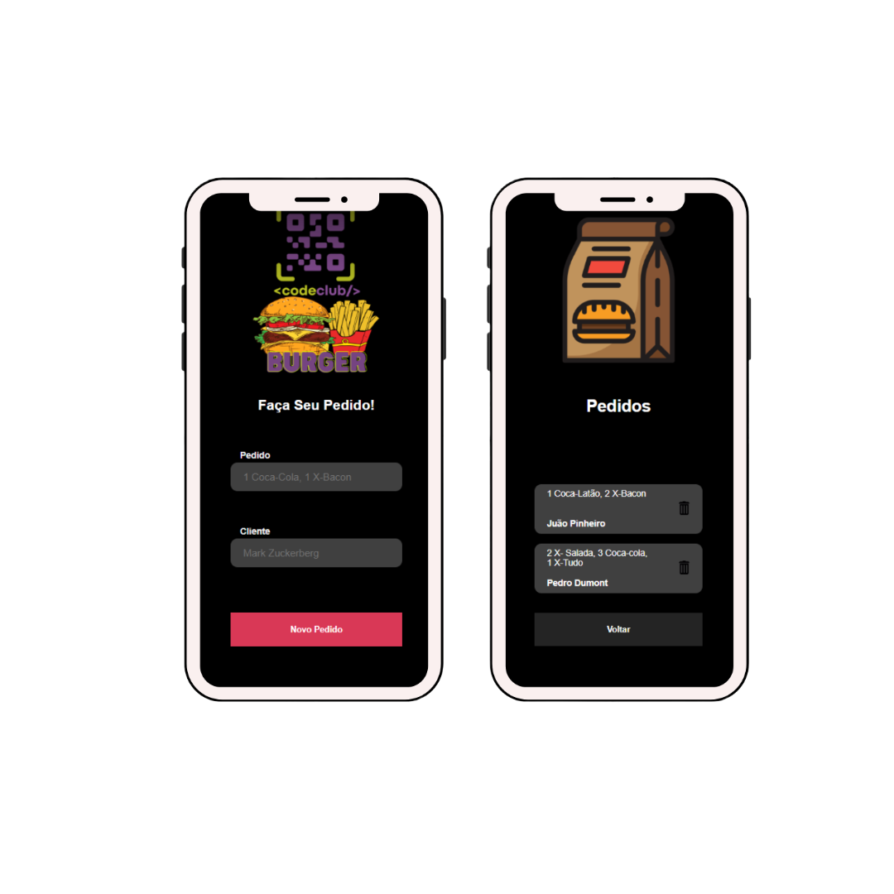

# 🍔ㅤHamburguer Request

#### O hamburguer request básicamente pega o pedido e o nome do cliente e armazena!.

---

## 💻 Technologies 
###  [JavaScript](https://www.javascript.com) - Uma linguagem de programação interpretada estruturada.
###  [React.Js](https://pt-br.reactjs.org) - Uma biblioteca JavaScript para criar interfaces de usuário.
###    [Node.Js](https://nodejs.org/en/) - Um software de código aberto, multiplataforma.
---
          

---
Made with ❤️ por Juão Pinheiro 😊
